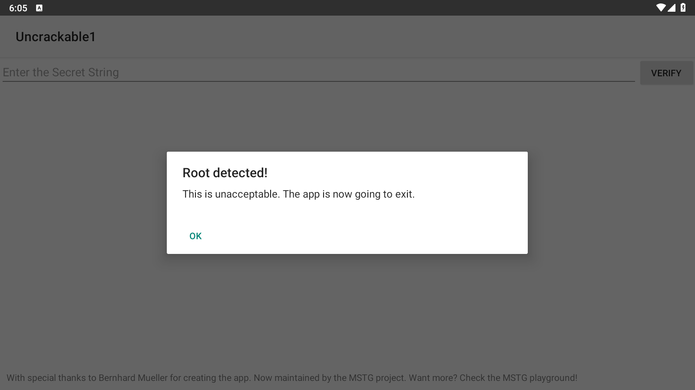
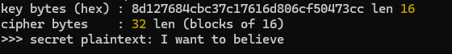
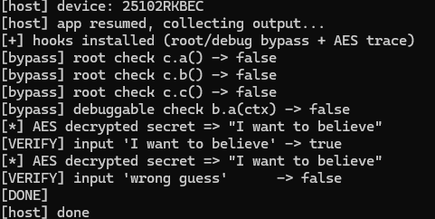

# OWASP UnCrackable Android Level 1 逆向 Writeup

> 靶场：OWASP MASTG 官方 Crackme —— UnCrackable Level 1
> 目标：绕过 root/调试检测，还原 App 隐藏的校验字符串
> 难度：★☆☆☆☆（Android 逆向入门）
> 环境：Windows 11 + 雷电9 模拟器（Android 9 / x86_64）+ jadx 1.5.6 + apktool 3.0.3 + Frida 17.17.0

---

## 0x00 背景与目标

UnCrackable 是 OWASP 移动安全测试指南（MASTG）提供的一系列 Android 入门 Crackme。Level 1 的 App 启动时会检测设备是否 root / 可调试，一旦命中就弹窗退出；主界面有一个输入框，输入正确的"秘密字符串"才会提示 Success。

我们要做两件事：
1. **静态分析**：读懂它的检测逻辑和校验逻辑，直接把隐藏字符串算出来；
2. **动态分析**：用 Frida 绕过 root/调试检测，并在运行时 hook 出解密后的明文。

> 练习样本与工具均为官方公开教学资源，仅用于授权学习环境。


*（真机截图：root 模拟器上启动 App，立刻弹 "Root detected! / This is unacceptable. The app is now going to exit."，点 OK 即 System.exit 退出）*

---

## 0x01 环境与工具

| 工具 | 版本 | 用途 |
|---|---|---|
| jadx | 1.5.6 | 反编译 APK 为 Java 源码 |
| apktool | 3.0.3 | 解包 smali / 资源 / AndroidManifest |
| adb (platform-tools) | 1.0.41 | 连接模拟器、装包、推文件 |
| Frida（客户端 + frida-server） | 17.17.0 | 动态 Hook（客户端在 PC，server 在模拟器） |
| 雷电模拟器 LDPlayer9 | Android 9 / x86_64 | 已开启 ROOT 的运行环境 |
| Node.js | — | 本地复现解密算法 |

关键命令：
```bash
# 反编译
jadx -d jadx-out UnCrackable-Level1.apk
# 解包
apktool d UnCrackable-Level1.apk -o apktool-out
# 连接模拟器（雷电默认 adb 端口）
adb connect 127.0.0.1:5555
adb devices
# 查看架构（决定下载哪个 frida-server）
adb shell getprop ro.product.cpu.abi   # x86_64
```

---

## 0x02 静态分析

### 2.1 AndroidManifest：找入口

解包后看 `apktool-out/AndroidManifest.xml`：

```xml
<manifest package="owasp.mstg.uncrackable1">
  <application android:allowBackup="true" ...>
    <activity android:name="sg.vantagepoint.uncrackable1.MainActivity">
      <intent-filter>
        <action android:name="android.intent.action.MAIN"/>
        <category android:name="android.intent.category.LAUNCHER"/>
      </intent-filter>
    </activity>
  </application>
</manifest>
```

- 包名 `owasp.mstg.uncrackable1`，主 Activity 是 `sg.vantagepoint.uncrackable1.MainActivity`。
- 顺带记一笔：`allowBackup="true"` 允许备份提取数据，本身也是个安全配置问题。

### 2.2 入口 MainActivity：检测逻辑

jadx 反编译后打开 `sg/vantagepoint/uncrackable1/MainActivity.java`，核心在 `onCreate` 和 `verify`：

```java
@Override
protected void onCreate(Bundle bundle) {
    if (c.a() || c.b() || c.c()) {      // root 检测三件套
        a("Root detected!");            // 弹窗 + System.exit(0)
    }
    if (b.a(getApplicationContext())) { // 可调试检测
        a("App is debuggable!");
    }
    super.onCreate(bundle);
    setContentView(R.layout.activity_main);
}

public void verify(View view) {
    String input = ((EditText) findViewById(R.id.edit_text)).getText().toString();
    if (a.a(input)) {                   // ← 校验逻辑在 uncrackable1.a
        // Success! This is the correct secret.
    } else {
        // Nope... Try again.
    }
}
```

`a(String)` 弹窗方法里点 OK 会 `System.exit(0)`，且 `setCancelable(false)`——这就是 root 设备上 App 直接闪退的原因。

调用链先理清：

```
MainActivity.onCreate
 ├── c.a() / c.b() / c.c()   → sg.vantagepoint.a.c   （root 检测）
 ├── b.a(context)            → sg.vantagepoint.a.b   （debuggable 检测）
MainActivity.verify(input)
 └── a.a(input)              → sg.vantagepoint.uncrackable1.a （字符串校验）
                              └── sg.vantagepoint.a.a.a(key, cipher) （AES 解密）
```

### 2.3 root / 调试检测

`sg/vantagepoint/a/c.java`（root 检测，三个无参静态方法）：

```java
public static boolean a() {  // 遍历 PATH 环境变量找 su
    for (String dir : System.getenv("PATH").split(":"))
        if (new File(dir, "su").exists()) return true;
    return false;
}
public static boolean b() {  // Build.TAGS 含 test-keys
    String tags = Build.TAGS;
    return tags != null && tags.contains("test-keys");
}
public static boolean c() {  // 检查常见 superuser APK / 守护进程路径
    for (String p : new String[]{"/system/app/Superuser.apk","/system/xbin/daemonsu", /* ... */})
        if (new File(p).exists()) return true;
    return false;
}
```

`sg/vantagepoint/a/b.java`（可调试检测）：

```java
public static boolean a(Context context) {
    return (context.getApplicationContext().getApplicationInfo().flags & 2) != 0; // FLAG_DEBUGGABLE
}
```

这四个方法都返回 `boolean`，动态 Hook 时让它们统一返回 `false` 即可绕过。

### 2.4 校验逻辑：AES 解密后比对

真正的校验在 `sg/vantagepoint/uncrackable1/a.java`：

```java
public static boolean a(String str) {
    byte[] ret = new byte[0];
    try {
        ret = sg.vantagepoint.a.a.a(
            b("8d127684cbc37c17616d806cf50473cc"),                              // key（hex 字符串）
            Base64.decode("5UJiFctbmgbDoLXmpL12mkno8HT4Lv8dlat8FxR2GOc=", 0)    // ciphertext（Base64）
        );
    } catch (Exception e) { ... }
    return str.equals(new String(ret));   // 解密结果和输入比较
}

// b()：把 hex 字符串转成字节数组（16 字节 → AES-128 密钥）
public static byte[] b(String str) { ... }
```

AES 助手在 `sg/vantagepoint/a/a.java`：

```java
public static byte[] a(byte[] key, byte[] data) throws ... {
    SecretKeySpec spec = new SecretKeySpec(key, "AES/ECB/PKCS7Padding");
    Cipher cipher = Cipher.getInstance("AES");
    cipher.init(2, spec);          // init(2) = Cipher.DECRYPT_MODE → 解密
    return cipher.doFinal(data);
}
```

结论：
- 算法 **AES-128-ECB**（`Cipher.getInstance("AES")` 在 Android 上默认 ECB/PKCS5Padding）；
- 密钥是 hex `8d127684cbc37c17616d806cf50473cc` → 16 字节；
- 密文是 Base64 `5UJiFctbmgbDoLXmpL12mkno8HT4Lv8dlat8FxR2GOc=`（32 字节，2 个分组）；
- 解密后的明文字符串就是答案。

---

## 0x03 静态求解（不跑 App 直接算）

密钥和密文都硬编码在代码里，本地解密即可。Node 版 `solve-static.js`：

```javascript
const crypto = require("crypto");
const key = Buffer.from("8d127684cbc37c17616d806cf50473cc", "hex");
const ct  = Buffer.from("5UJiFctbmgbDoLXmpL12mkno8HT4Lv8dlat8FxR2GOc=", "base64");
const d = crypto.createDecipheriv("aes-128-ecb", key, null);
d.setAutoPadding(true);
console.log(">>> secret:", Buffer.concat([d.update(ct), d.final()]).toString());
```

运行：

```bash
$ node solve-static.js
key bytes (hex) : 8d127684cbc37c17616d806cf50473cc len 16
>>> secret plaintext: I want to believe
```

得到秘密字符串：**`I want to believe`**（《X 档案》经典台词）。

> 也可以用 Python：`Crypto.Cipher.AES.new(key, AES.MODE_ECB).decrypt(ct)` 后去 PKCS7 padding；或 `openssl enc -d -aes-128-ecb -K <hexkey> -nopad`。


*（截图位：jadx 里 uncrackable1.a 校验代码 + 终端 node 解出明文）*

~~~javascript
package sg.vantagepoint.uncrackable1;

import android.util.Base64;
import android.util.Log;

/* JADX INFO: loaded from: classes.dex */
public class a {
    public static boolean a(String str) {
        byte[] bArrA;
        byte[] bArr = new byte[0];
        try {
            bArrA = sg.vantagepoint.a.a.a(b("8d127684cbc37c17616d806cf50473cc"), Base64.decode("5UJiFctbmgbDoLXmpL12mkno8HT4Lv8dlat8FxR2GOc=", 0));
        } catch (Exception e) {
            Log.d("CodeCheck", "AES error:" + e.getMessage());
            bArrA = bArr;
        }
        return str.equals(new String(bArrA));
    }

    public static byte[] b(String str) {
        int length = str.length();
        byte[] bArr = new byte[length / 2];
        for (int i = 0; i < length; i += 2) {
            bArr[i / 2] = (byte) ((Character.digit(str.charAt(i), 16) << 4) + Character.digit(str.charAt(i + 1), 16));
        }
        return bArr;
    }
}
~~~


---

## 0x04 动态分析（Frida 绕过 + Hook）

静态已经能出答案，但动态的目的是：在 root 模拟器上让 App 正常跑起来，并在运行时"亲眼"抓到解密明文——这是真实逆向里更通用的手法（密钥不是硬编码、而是运行时生成/网络下发时，静态就不够了）。

### 4.1 部署 frida-server

Frida 客户端（PC）和 frida-server（模拟器）**版本必须严格一致**，架构要匹配：

```bash
# 1) 查架构 → x86_64，下载 frida-server-17.17.0-android-x86_64.xz 解压
# 2) 推进模拟器并赋权
adb push frida-server-x86_64 /data/local/tmp/frida-server
adb shell su -c 'chmod 755 /data/local/tmp/frida-server'
# 3) root 后台启动
adb shell su -c 'nohup /data/local/tmp/frida-server >/dev/null 2>&1 &'
# 4) PC 端验证
frida-ps -U        # 能列出模拟器进程即连通
```

### 4.2 ★ Frida 17 的坑（重要）

Frida 17 起**移除了脚本里的全局 `Java` 对象**，也不再由 Python `create_script` 自动注入 Java bridge。正确写法是显式引入，并且要用 **ESM 默认导入**：

```javascript
// ✅ Frida 17 正确写法
import Java from "frida-java-bridge";

// ❌ 直接用全局 Java          → ReferenceError: Java is not defined
// ❌ const Java = require("frida-java-bridge")
//    → 拿到的是模块对象 { default: ... }，Java.perform 报 "not a function"
```

用 Python 自动化注入时，需要先用 `frida-compile` 把 bridge 打包进脚本（输出用 IIFE 格式最稳）：

```bash
npm install frida-java-bridge frida-compile
npx frida-compile verify-final.js -o verify-final.bundle.js -B iife -S
```

> 如果用 `frida` 命令行（`frida -U -f 包名 -l hook.js`），CLI 会自动处理 ESM 编译；Python API 则需要上面的 bundle 步骤。

### 4.3 Hook 脚本

`verify-final.js`（绕过检测 + 抓 AES 明文 + 主动验证）：

```javascript
import Java from "frida-java-bridge";

Java.perform(function () {
    // 1) 绕过 root 检测：c.a()/c.b()/c.c() 全部返回 false
    var c = Java.use("sg.vantagepoint.a.c");
    c.a.implementation = function () { console.log("[bypass] root c.a() -> false"); return false; };
    c.b.implementation = function () { console.log("[bypass] root c.b() -> false"); return false; };
    c.c.implementation = function () { console.log("[bypass] root c.c() -> false"); return false; };

    // 2) 绕过 debuggable 检测：b.a(Context) 返回 false
    var b = Java.use("sg.vantagepoint.a.b");
    b.a.overload("android.content.Context").implementation = function (ctx) {
        console.log("[bypass] debuggable b.a(ctx) -> false");
        return false;
    };

    // 3) Hook AES 解密助手，直接打印解密后的明文
    var aes = Java.use("sg.vantagepoint.a.a");
    aes.a.overload("[B", "[B").implementation = function (key, data) {
        var out = this.a(key, data);
        console.log("[*] AES decrypted secret => \"" + Java.use("java.lang.String").$new(out) + "\"");
        return out;
    };
    console.log("[+] hooks installed");
});

// 4) 主动调用校验函数验证答案（spawn 后等 App 起来）
setTimeout(function () {
    Java.perform(function () {
        var Check = Java.use("sg.vantagepoint.uncrackable1.a");
        console.log("[VERIFY] 'I want to believe' -> " + Check.a("I want to believe"));
        console.log("[VERIFY] 'wrong guess'      -> " + Check.a("wrong guess"));
        console.log("[DONE]");
    });
}, 3500);
```

用 Python spawn 注入（`run_verify.py` 加载 bundle）后输出：

```
[host] device: 25102RKBEC
[host] app resumed, collecting output...
[+] hooks installed (root/debug bypass + AES trace)
[bypass] root check c.a() -> false
[bypass] root check c.b() -> false
[bypass] root check c.c() -> false
[bypass] debuggable check b.a(ctx) -> false
[*] AES decrypted secret => "I want to believe"
[VERIFY] input 'I want to believe' -> true
[VERIFY] input 'wrong guess'      -> false
[DONE]
```

- root / 调试检测全部绕过，App 在模拟器上不再闪退；
- Hook `Cipher.doFinal` 的上层封装 `sg.vantagepoint.a.a.a` 直接拿到明文 `I want to believe`；
- 用正确字符串调用校验返回 `true`，错误字符串返回 `false`，与静态结果一致。


*（截图位：终端 Frida 输出 bypass 日志 + AES 明文 + VERIFY true/false；模拟器上 App 正常进入界面）*

### 4.4 通用 Hook 点（真实 App 抓密钥更常用）

这个靶场把 AES 封装在自己的类里。真实 App 更多是直接调标准库，那时 Hook 系统 API 一招通吃：

```javascript
// 抓 AES 密钥 / IV / 明文密文
var Cipher = Java.use("javax.crypto.Cipher");
Cipher.doFinal.overload("[B").implementation = function (input) {
    var out = this.doFinal(input);
    console.log("[Cipher] mode=" + this.getOpmode() + " in=" + input + " out=" + out);
    return out;
};
var KeySpec = Java.use("javax.crypto.spec.SecretKeySpec");
KeySpec.$init.overload("[B", "java.lang.String").implementation = function (key, algo) {
    console.log("[Key] algo=" + algo + " key=" + bytesToHex(key));
    this.$init(key, algo);
};
// 抓 MD5/SHA：Hook java.security.MessageDigest.digest
// 抓 HMAC：Hook javax.crypto.Mac.doFinal
```

---

## 0x05 拓展：改 smali 重打包（另一条路）

不用 Frida 也能改：在 `apktool-out/smali/sg/vantagepoint/a/c.smali` 里把三个检测方法的返回值改成 `false`（`const/4 v0, 0x0` 再返回），或把校验方法直接改成返回 `true`，然后：

```bash
apktool b apktool-out -o rebuilt.apk
# 还需 zipalign 对齐 + apksigner 签名（Android build-tools）才能安装
```

Frida 的优势是**不改包、动态、可反复调**；改包适合需要脱离 Hook 环境运行的场景。

---

## 0x06 防御启示（站在开发者角度）

这个 Crackme 几乎集中了移动端常见的"自我保护"反面教材：

1. **root / 调试检测可被轻易 Hook**：检测函数在 Java 层且返回布尔值，Frida 一行 `return false` 就绕过。强保护应放到 native（.so）层并做反 Hook / 完整性校验。
2. **密钥硬编码 + 对称加密本地校验**：AES 密钥和密文都在 APK 里，等于把锁和钥匙放在一起。本地"秘密"无法真正保密，关键校验应放在服务端。
3. **ECB 模式**：AES-ECB 不隐藏明文模式，生产应使用 GCM/CBC + 随机 IV。
4. **`allowBackup="true"`**、日志泄露（`Log.d("CodeCheck", ...)`）等配置问题会进一步放大攻击面。
5. 正确思路：**重要逻辑/判定服务端化**、密钥不下发、用成熟的加固/反调试方案并持续更新，而不是依赖单点客户端校验。

---

## 0x07 总结

- **静态**：jadx 跟调用链 `MainActivity → c/b 检测 → uncrackable1.a 校验 → AES 解密`，识别 AES-128-ECB，硬编码密钥 `8d127684...473cc` 解出明文 **`I want to believe`**。
- **动态**：Frida 17（ESM `import Java from "frida-java-bridge"` + frida-compile 打包）Hook 三个 root 检测、一个 debuggable 检测和 AES 解密函数，运行时抓到同样的明文。
- **收获**：理清了"Manifest 找入口 → jadx 读逻辑 → 静态解密 / Frida 动态验证"的标准 Android 逆向流程，也踩平了 Frida 17 的 bridge 引入坑。

**工具与脚本**：`jadx` / `apktool` / `frida` / `solve-static.js` / `verify-final.js`（+bundle）/ `run_verify.py`，均随本 writeup 仓库提供。

---

*参考：[OWASP MASTG Crackmes](https://mas.owasp.org/crackmes/Android/)*